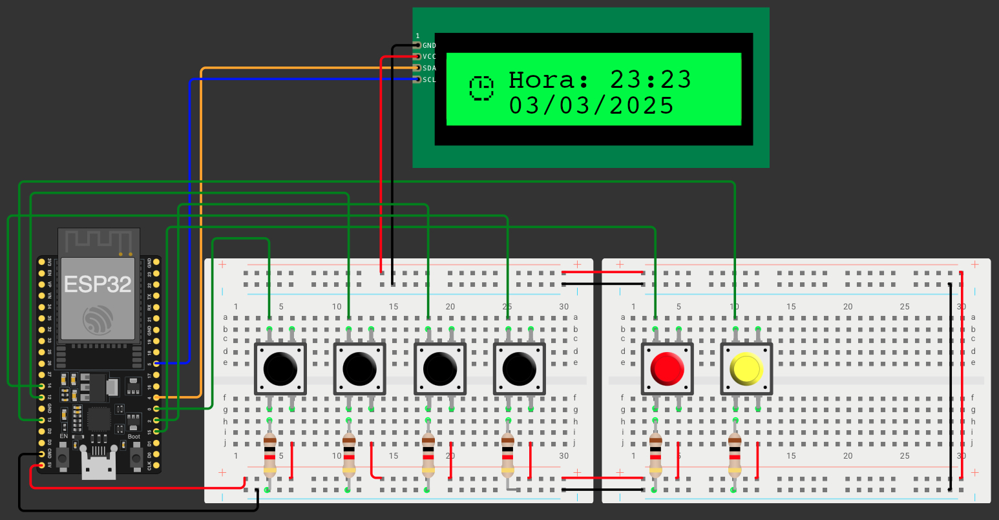

# Alarme_ESP8266

Projeto de um alarme utilizando a placa ESP8266MOD com um LCD 16x2 e 6 botões.

## Funcionalidades
- Pegar hora e data do servidor NTP
- Definir hora e data [FAZENDO...]

## Bibliotecas utilizadas
- ESP8266WiFi
- TimeLib
- WiFiUdp
- Wire
- LiquidCrystal_I2C

## Componentes utilizados
- 1 ESP8266MOD
- 6 Push Buttons
- 6 Resistores de 1k ohms
- 1 LCD 16x2
- Jumpers
- Protoboards

## Esquema
